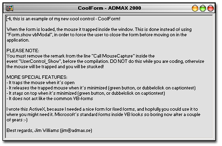



## JW\_CoolForm

### Description

Enhance the common VB-Form, to look more cool and act with some other features.

Please also see the JW_Cooltab control from me :-)
 
### More Info
 
All to know is inside the Zip-package :-)

None what I know about...

             |
---                |---
**Submitted On**   |2001-01-01 14:01:20
**By**             |[Jim Williams](https://github.com/Planet-Source-Code/PSCIndex/blob/master/ByAuthor/jim-williams.md)
**Level**          |Advanced
**User Rating**    |3.5 (14 globes from 4 users)
**Compatibility**  |VB 6\.0
**Category**       |[Custom Controls/ Forms/  Menus](https://github.com/Planet-Source-Code/PSCIndex/blob/master/ByCategory/custom-controls-forms-menus__1-4.md)
**World**          |[Visual Basic](https://github.com/Planet-Source-Code/PSCIndex/blob/master/ByWorld/visual-basic.md)
**Archive File**   |[CODE\_UPLOAD13232112001\.zip](https://github.com/Planet-Source-Code/jim-williams-jw-coolform__1-13999/archive/master.zip)

